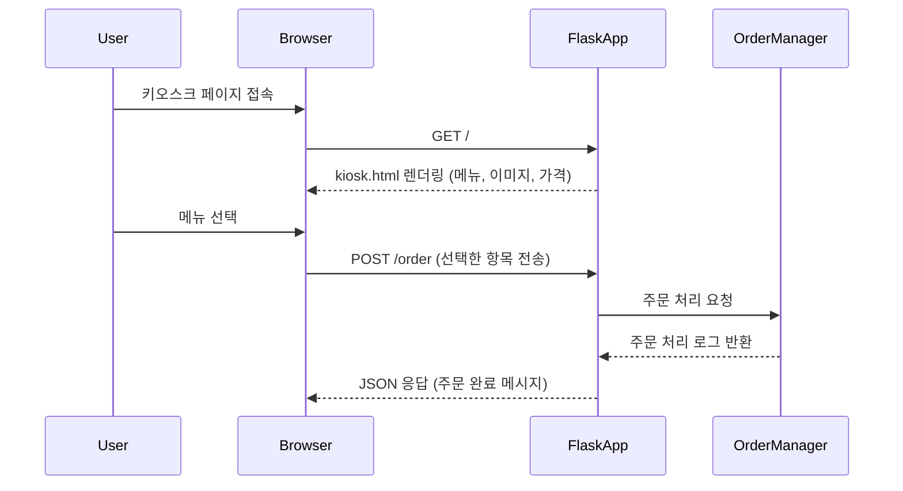

# Software-Engineering  
소프트웨어 공학 과제  
컴퓨터공학과 / 20190035 / 나상준

---

## 소프트웨어 사용 사례: **카페 키오스크 시스템**

요즘 카페에 자주 도입된 **무인 키오스크 시스템**을 모델링 대상으로 삼았습니다.  
사용자는 키오스크 화면을 통해 원하는 음료를 고르고, 시스템은 해당 주문을 처리하여 응답합니다.

---

## 시퀀스 다이어그램

> 아래는 Mermaid 문법을 활용하여 작성한 시퀀스 다이어그램입니다.

---

## 디렉토리 구조

<pre>

SampleCode/
├── app.py                     # Flask 서버의 메인 실행 파일
├── kiosk/
│   ├── __init__.py
│   └── order_manager.py       # 주문 관리 로직 담당 모듈
├── templates/
│   └── kiosk.html             # 사용자 인터페이스(키오스크 웹페이지)
├── static/
│   └── images/                # 음료 이미지 리소스
│       ├── americano.png
│       ├── latte.png
│       ├── vanilla_latte.png
│       └── cappuccino.png
└── README.md                  # 과제 설명 파일

</pre>

## 샘플코드 실행방법 

**패키지 설치** 
pip install flask

**앱 실행**
python app.py

# 가상환경 생성 (필요한 경우)
python3 -m venv venv

# 가상환경 활성화 (Mac/Linux)
source venv/bin/activate
---

## 파일 설명

## app.py
Flask 애플리케이션의 메인 진입점입니다.

/ 경로로 접속 시 kiosk.html을 렌더링합니다.

/order 경로는 주문을 받아 OrderManager로 처리 요청을 전달하고 JSON 응답을 반환합니다.

## kiosk/order_manager.py
OrderManager 클래스는 음료 정보를 가지고 있으며, 주문을 처리하고 로그를 생성합니다.

## templates/kiosk.html
Bootstrap 기반의 웹 UI입니다.

메뉴 선택 버튼이 포함되어 있으며, 사용자의 선택을 JavaScript로 /order에 전송합니다.

## static/images/
UI에 표시되는 음료 이미지를 보관합니다.

음료 카드와 연결된 시각적 요소로 사용됩니다.

---

## 모듈성 평가

| 항목           | 평가 내용                                             |
| ------------ | ------------------------------------------------- |
| ✅ **응집도**    | `OrderManager`는 주문 처리라는 단일 책임에 집중되어 있어 응집도가 높습니다. |
| ✅ **결합도**    | 주문 처리와 웹 UI가 명확히 분리되어 있어 결합도가 낮고 유지보수가 용이합니다.     |
| 🧱 **확장성**   | 메뉴 추가/수정이 간단하며, 데이터베이스 연동 등으로 구조 확장이 가능합니다.       |
| 🔧 **유지보수성** | 파일과 기능이 역할별로 분리되어 있어 수정이나 테스트 시 부담이 적습니다.         |
